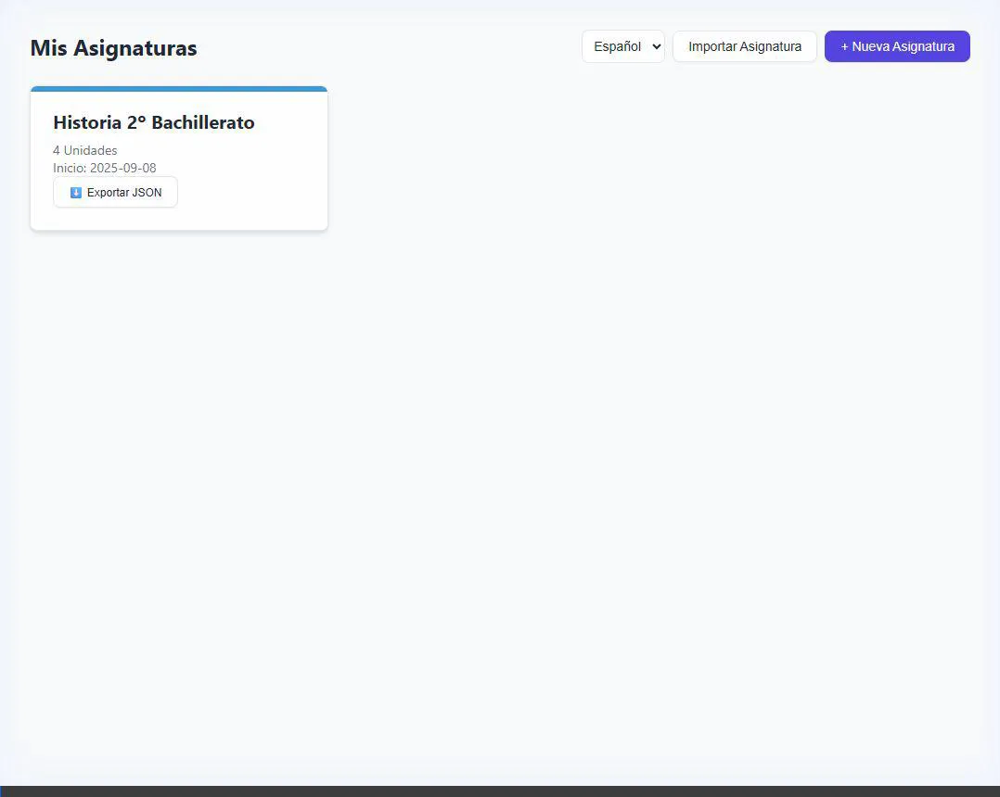

# CourseMap Planner

CourseMap Planner is a portable browser-based course planning app for teachers. It helps organize subjects, distribute units and activities across the academic calendar, account for holidays, and keep planning data stored locally in the browser.



## Features

- Create and manage multiple subjects from a dashboard view
- Plan by unit or by detailed activity
- Assign weekly session counts and automatically distribute content across the calendar
- Mark local holidays directly on the calendar
- Export and import full subject plans as JSON
- Export and import holiday sets between subjects
- Generate a printable planning summary
- Switch between multiple interface languages
- Store data locally with offline-friendly behavior
- Install the app as a PWA when served through `localhost` or `https`

## Tech Stack

- JavaScript
- HTML
- CSS
- LocalStorage
- Node.js

## Project Structure

```text
.
├── index.html                # Main single-page application
├── locales.js                # Translation strings
├── i18n.js                   # Language handling
├── build.js                  # Production build script
├── manifest.webmanifest      # PWA manifest
├── sw.js                     # Service worker
├── icons/
│   └── icon.svg              # App icon
├── dist/                     # Production output
├── DOCUMENTACION.md          # User documentation
└── DOCUMENTACION.html        # Rendered documentation
```

## Development

This project is mostly a self-contained frontend app. For basic local usage, you can open `index.html` in a browser.

For PWA installation features, serve the project through a local web server instead of opening it with `file://`.

Example options:

```bash
npx serve .
```

or

```bash
python -m http.server 8000
```

Then open the app in a browser through `http://localhost:8000` or the port exposed by your server.

## Build

Install dependencies:

```bash
npm install
```

Create the production build:

```bash
node build.js
```

The build output is generated in `dist/` and includes:

- Minified `index.html`
- `manifest.webmanifest`
- `sw.js`
- `locales.js`
- `i18n.js`
- PWA icon assets

## PWA Notes

The app includes a web app manifest and a service worker, which makes it installable as a Progressive Web App when served from a secure context.

Requirements for installation:

- Open the app through `localhost` or `https`
- Use a browser with PWA install support
- Allow the browser to load the manifest and service worker successfully

Opening the app directly with `file://` may still work for normal usage, but it will not behave as an installable PWA.

## Data Storage

Application data is stored in the browser using `localStorage`.

This means:

- Data is saved automatically
- Data stays on the current browser profile
- Moving to another device or browser requires exporting the subject data as JSON

## Documentation

Additional end-user documentation is available in:

- [DOCUMENTACION.md](./DOCUMENTACION.md)
- [DOCUMENTACION.html](./DOCUMENTACION.html)
